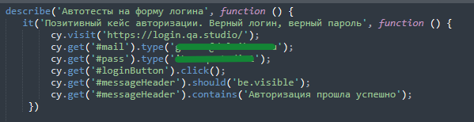
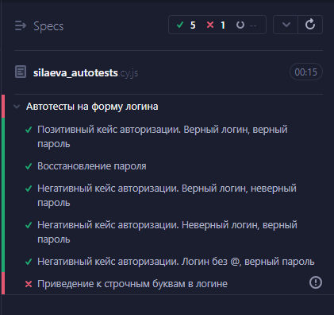

# Пример автоматизированного тестирования интерфейса и функциональности веб-приложениий с помощью Cypress 

> С помощью **Cypress** вы можете легко создавать автотесты для своих современных веб-приложений, визуально отлаживать их и автоматически запускать в сборках непрерывной интеграции

## [Содержание](#Содержание)
[Цель проекта](#Цель-проекта)  
[Преимущества](#Преимущества)  
[Технические детали](#Технические-детали)  
[Результаты прохождения тестов](#Результаты-прохождения-тестов)

**Cypress** позволяет разрабатывать и реализовывать автотесты для проверки функциональности и пользовательского интерфейса веб-приложения. Использование **Cypress** обеспечивает быструю и эффективную проверку элементов интерфейса, а также поведения приложения при различных пользовательских взаимодействиях.

### Цель проекта
В проекте были реализованы автотесты для проверки:
- авторизации для сайта [login.qa.studio](https://login.qa.studio/) 
- покупки и смены нового аватара тренера для сайта [Битва покемонов](https://pokemonbattle.me/)

[Назад к содержанию](#Содержание)
### Преимущества
- Ускорение процесса тестирования за счет автоматизации.
- Повышение точности и надежности тестирования за счет исключения человеческого фактора.
- Возможность быстро идентифицировать проблемы интерфейса и функциональности благодаря детальным отчетам о тестировании.

[Назад к содержанию](#Содержание)
### Технические детали
- Автоматизация тестов с использованием языка программирования `JavaScript`.
- Применение различных стратегий селекторов для эффективного доступа к элементам DOM.
- Моделирование пользовательских сценариев, включая ввод данных и взаимодействие с элементами UI.

[Назад к содержанию](#Содержание)
### Пример тестового сценария

    

[Назад к содержанию](#Содержание)

### Результаты прохождения тестов
В **Sypress** очень легко просматривать результаты прохождения тестов, какие тесты были пройдены, какие тесты упали. Если тест упал, можно сразу увидеть, что вызвало падение и на каком этапе.

    

[Назад к содержанию](#Содержание)

